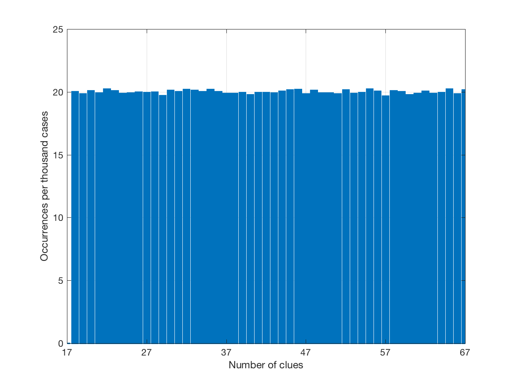
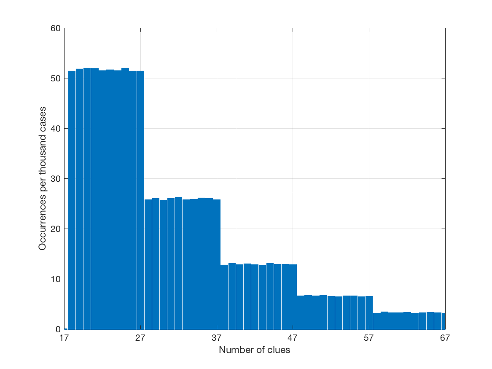
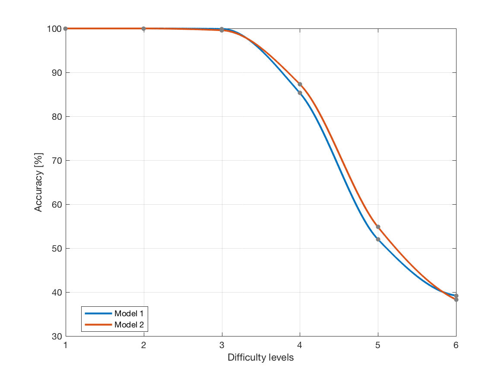
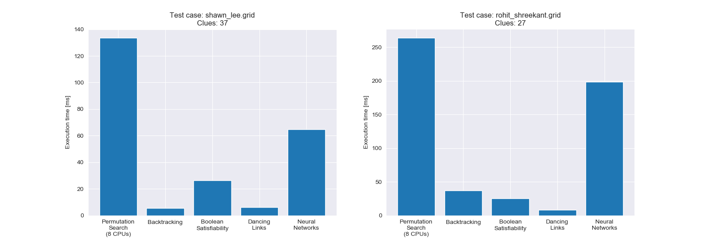
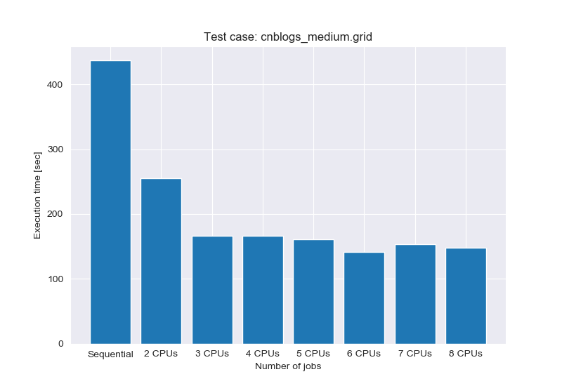

**Concurrent Programming and Convolution Neural Networks**
<br> - *a Sudoku solver exploratory project*

[](https://travis-ci.org/hubotio/hubot)
[](https://coveralls.io/github/hubotio/hubot?branch=master)

**Abstract**
We implemented a Sudoku solver with five different methods (seven planned initially, two later discarded) that can solve any 9x9 Sudoku puzzles in a small amount of time. They are

* ~~Simulated Annealing~~
* Permutation Search (Parallelized)
* ~~Integer Programming~~
* Back Tracking
* Boolean Satisfiability
* Dancing Links
* Convolution Neural Networks

We attempted to give each method analysis for its runtime in the worst case. All approaches that reduce Sudoku puzzles into other NP-complete problems have exponential times. Due to the optimization of data structures and algorithms, the amounts of computation in practice are much less than those required for the worst cases. *Simulated Annealing*, which attempts to solve a Sudoku puzzle in the same manner of solving an inversion problem, was discarded because of its low efficiency.

*Convolution Neural Networks* (CNN) is the only approach in this project that solves Sudoku puzzles using probabilities, for which accuracy is much more concerned than efficiency. We tested the performance and accuracy of our CNN solver on several collections of test cases at different difficulty levels. For most test cases that were created using our generator, the accuracies are either 100% or nearly 100%, while for level six which was obtained from Dani Berg's GitHub repository, the accuracy is poorer. After modifying the distribution of difficulty levels in the training dataset, some improvement in the average accuracy but not in efficiency was observed, which suggests that the modified training model is better. Compared to the insanely large number of status for Sudoku puzzles, 1.96x10<sup>20</sup>, an average accuracy of 80.0% obtained from neural networks trained with only a million quizzes is impressive.

The repository contains the following components
* `main.py` for you to play around a few collected puzzles one at a time and compare the speed of different algorithms
* `generator.py` for creating training data and test cases for the CNN model
* `test_accuracy.py` for solving 1000 test cases with CNN and calculating the correctness
* Pre-trained models for CNN are not included because of the file size limit of GitHub

**Requirements**
* Python 2.7 required
* `keras`, `pandas`, `pycosat`, `sklearn`, `tensorflow`
* The project is not expected to work on a *Jupyter Notebook* because of `multiprocessing`

**Keywords** NP-completeness, discrete math, time complexity, concurrency, constraint satisfaction

---

**Preface**
> Programming a Sudoku solver is not difficult, but can be turned into a challenging problem if a time limit is given. Since Sudoku is an NP-complete problem, an elementary approach such as the brute force search is too slow to be considered. As a novice in computer science, I would like to give each advanced method a try and optimize them. We are in the hope that at least one of these methods can solve the world's hardest Sudoku puzzle by Arto Inkala in 100 milliseconds.

An example output from test case `wikipedia.grid` using algorithm *Back Tracking*:
```
Loading ./input/wikipedia.grid
  17 clues given.
* ----- + ----- + ----- *
|       |       |       |
|       |     3 |   8 5 |
|     1 |   2   |       |
* ----- + ----- + ----- *
|       | 5   7 |       |
|     4 |       | 1     |
|   9   |       |       |
* ----- + ----- + ----- *
| 5     |       |   7 3 |
|     2 |   1   |       |
|       |   4   |     9 |
* ----- + ----- + ----- *

Searching for singletons iteratively...
   5 singleton(s) found!
   6 singleton(s) found!
   3 singleton(s) found!
   3 singleton(s) found!
   1 singleton(s) found!
   1 singleton(s) found!

Calling recursively...
Base case triggered!
* ----- + ----- + ----- *
| 9 8 7 | 6 5 4 | 3 2 1 |
| 2 4 6 | 1 7 3 | 9 8 5 |
| 3 5 1 | 9 2 8 | 7 4 6 |
* ----- + ----- + ----- *
| 1 2 8 | 5 3 7 | 6 9 4 |
| 6 3 4 | 8 9 2 | 1 5 7 |
| 7 9 5 | 4 6 1 | 8 3 2 |
* ----- + ----- + ----- *
| 5 1 9 | 2 8 6 | 4 7 3 |
| 4 7 2 | 3 1 9 | 5 6 8 |
| 8 6 3 | 7 4 5 | 2 1 9 |
* ----- + ----- + ----- *

Elapsed time is 0.038191 seconds.
```

### Integer Programming

*Integer Programming* (some articles call it *Constraint Programming*) transforms a Sudoku puzzle into a linear planning problem with the constraint that "all decision variables must be integers". An ordinary linear planning problem attempts to find one or more optimal solutions under linear inequality constraints. When it comes to Sudoku puzzles, there are nine values each box can be filled with, and we are constrained along each of the nine rows and nine columns. We have 9<sup>3</sup> = 729 parameters. By indexing these values in x by v (value), r (row), and c (column), we can formulate our objective function and linear constraints as follows.


<small>Primal formulation for solving a generic Sudoku problem. Adapted from https://towardsdatascience.com/using-integer-linear-programming-to-solve-sudoku-puzzles-15e9d2a70baa.</small>

The first constraint requires that each cell, denoted by its row and column, contains one value. The second and third constraints maintain that only one of the values is within a column and row, respectively. The last constraint fixes that only one of the values is found in each subgrid. We then solve these formulations by means of constraint programming - the *Simplex Method*.

As an NP-hard problem, *Integer Programming* requires more time to solve than a generalized linear planning problem. The worst-case runtime of the *Simplex Method* is non-polynomial.

### Back Tracking - O[n<sup>m</sup>]

*Back Tracking*, in cooperation with Peter Norvig's *Constraint Propagation*, is a powerful way of solving Sudoku puzzles. The idea of *Back Tracking* aims to solve a Sudoku puzzle in a similar manner to address the classical N-queens problem. This NP-hard problem attempts to find an arrangement of N queens on a chessboard so that no queen can attack any other queens on the board. The chess queens can attack in any direction as a vertical, a horizontal, or a diagonal way. Different from a basic recursive strategy, the algorithm for solving N-queens introduces a "repent" when there is no cell to take the next step.


<small>Visual example of the eight queens backtrack algorithm. Adapted from https://en.wikipedia.org/wiki/Eight_queens_puzzle.</small>

Imagine a 9x9 Sudoku with 17 existing numbers (17 is the smallest number of clues needed to have a unique solution) is being solved. An empty cell is selected, and a list of candidates is generated by searching horizontally, vertically, and by checking its peers in the same 3x3 box. From the generated candidate list, a number is selected and filled into the empty cell, which yields a Sudoku grid with 18 clues.

We now have a grid with 18 numbers filled in. This status serves as a subproblem of the initial status with 17 clues, and will be solved in the same manner; namely, it is passed as an argument to the function itself, which is where the idea of recursion is realized. The base case of the algorithm is triggered when the grid is full, in which case the solution is returned or yielded (like a generator). To realize that, we developed the following algorithm, and the place where the function is called recursively is commented.
```python
def n_queens(grid):

    if is_full(grid):
        print "Base case triggered!"
        return grid

    else:
        # select a cell and list its candidates
        clues = cache_clues(grid)  # save clues in structures for fast caching
        ti,tj = sel_empty_cell_sorted(clues, grid)
        candidates = lst_candidates_fast(clues, ti,tj)

        if candidates:  # non empty

            for c in candidates:
                grid[ti][tj] = c
                sol = n_queens(grid)  # n_queens() invokes itself!
                if sol:
                    return sol
                else:
                    grid[ti][tj] = 0
                    continue

            # after trying all candidates, no solution found
            grid[ti][tj] = 0
            return False

        else:  # there are no candidates available
            return False
```
If there is no choice for candidates at a certain level, the algorithm backtracks and another number is filled in. In another case, after all candidates are tried, and still no solution is found, it continues to backtrack and switch to the next attempt. The algorithm eventually leads to a valid solution, based on that "if the correct number is chosen for an empty cell, no dead-end should occur in any deeper depth of the recursion, until there is no more empty cell."

To effectively reduce the number of choices for each selected cell (and thus prune the recursive branches), a technique called *Constraint Propagation* (as already mentioned) is tried. There are two rules in this approach to follow:
1. For any cell, if a number already exists in its row, column, or box (the cell's peers), the possibility of that number for that cell is removed.
2. For any cell, if all of its peers has a specific number removed, the cell itself must contain that number.

By repeatedly applying these two rules, the possibilities are gradually minimized, and more singletons can be discovered.

For Rule II, there are two additional inferences you may have already discovered:
1. Rule II produces at most one possibility. If there are two or more numbers removed from all peers of an empty cell, there is either something wrong with your Sudoku or something wrong with your algorithm.
2. For any empty cell, the answer determined by Rule II must be one of the choices given by Rule I (Rule I and Rule II do not contradict).

*Constraint Propagation* is a quite useful technique even in the situation of speeding up a brute force algorithm. Although this takes more work for each cell to be analyzed, programming it smartly (with the assistant of fast caching) may help speed up *Back Tracking* dramatically.

The worst-case runtime of *Back Tracking* is O[n<sup>m</sup>], where n is the number of choices for each square and m is the number of spaces that are blank, which theoretically is not less than the worst-case time complexity of a brute force search. In reality, *Back Tracking* is way faster than *Brute Force* because it is quite far from the worst case in most cases. As the depth of the recursion increases, the number of choices becomes smaller and smaller. Because of this fact, *Back Tracking* has excellent potential to become an algorithm to solve Sudoku puzzles efficiently.

### Boolean Satisfiability - O[2<sup>n</sup>]

After going through many articles, I found *Boolean Satisfiability* the most unheard way of programming Sudoku solvers but must be highly recommended. The code is tidy and runs efficiently. As previously mentioned, all problems in the complexity class NP can be reduced into an NP-complete problem, and all NP-complete problems are equally difficult to solve. *Satisfiability* is the first problem that is proven to be NP-complete. In this project, I am using Nicholas Pilkington's code to implement a SAT-solver, and I would like to reaffirm his idea.


<small>A problem is NP-complete if it belongs to the set (or "class" if you prefer) of the hardest problems in NP-hardest in the sense that every problem ever exists in NP can be reduced to them. (Thus being able to solve an NP-complete problem is equivalent to being able to solve every problem in NP). Adapted from https://0a.io/chapter1/boolean-satisfiability-problem-or-sat-in-5-minutes.html.</small>

SAT-solvers are designed to solve a *Logical Circuit* problem that seeks to find a truth assignment for each of a set of boolean variables for which the whole expression is true. For example, `X1.X2+X3` is true when `X1` and `X2` are both true, which is not the only solution. Since ``X3`` being true or `X3`, `X1`, `X2` all being true are also solutions. So this SAT problem has three solutions.

The difficulty is that a Sudoku puzzle requires you to assign a numerical value to each of the 81 cells. In contrast, SAT-solvers use boolean variables that are either true or false. The Sudoku needs to be transformed into a boolean expression in CNF to be solved. As is explained in [Nicholas Pilkington's blog](https://nickp.svbtle.com/sudoku-satsolver), instead of having one variable per cell, we have 9 in the form `X(i,j,k)`; each variable describes whether the cell `i,j` has a value of `k`. However, this causes a problem because we need to enforce an additional constraint that exactly one of these variables is true for a given cell. We can do this in two parts.

Consider first a simple case where we have two variables `X1` and `X2` and want to enforce that exactly one is true. We can say that at least one variable must be true `(X1+X2)` and that both cannot be true `-(X1.X2)`, which is a logical XOR. We can generalize this to N variables, `X1, X2, ..., XN` by saying that as least one must be true `X1+X2+ ... +XN` and that no pair may both be true, `-(X1.X2) . -(X2.X3) . ... .` which conveniently happens to be in CNF.
```python
def exactly_one(variables):
    cnf = [ variables ]
    n = len(variables)

    for i in xrange(n):
        for j in xrange(i+1, n):
            v1 = variables[i]
            v2 = variables[j]
            cnf.append([-v1, -v2])

    return cnf
```
We also need a way to bijectively map the boolean variable `X(i,j,k)` to a linear variable number which can be done like this:
```python
def transform(i, j, k):
    return i*N*N + j*N + k + 1
```
We also need the inverse transform to get from a linear variable back to a cell and value:
```python
def inverse_transform(v):
    v, k = divmod(v-1, N)
    v, j = divmod(v, N)
    v, i = divmod(v, N)
    return i, j, k
```
Armed with this, we can generate the standard Sudoku constraints that the numbers 1 to 9 must appear in each row, each column, and each 3x3 sub-matrix exactly once. All that remains if to fix the values of the grid that are given. Then use the `inverse_transform` to map the CNF variables back to number for each corresponding cell.

The worst-case time complexity of *Boolean Satisfiability* is O[2<sup>n</sup> poly(m)] = O[2<sup>n</sup>], where n is the number of variables and m is the number of clauses / connectives / gates. Nicholas Pilkington noted in his blog that there are 11988 expressions in the final CNF, which is much nicer than traversing through all the 1.96x10<sup>20</sup> possibilities.

### Dancing Links - O[n<sup>m</sup>]

The *Algorithm X* or *Dancing Links (DLX)* approach reduces a Sudoku puzzle into an exact cover problem. Given a universe U of elements and a collection S of sets, the original idea of *Exact Cover* is to find a sub-collection S* of S such that every element in U is contained in exactly one set in S. An exact cover problem could have more than one solutions.
```
S = {A, B, C, D}, U = {1, 2, 3, 4, 5, 6}
A = {1, 3, 5}
B = {2, 4}
C = {2, 3, 4, 5, 6}
D = {2, 4, 6}
```
To solve this puzzle, one may find it helpful to represent the sets of input with '0's and '1's, denoted the *exact cover matrix*. Subsequently, the problem is transformed into finding all combinations of rows such that their union has exactly six '1's (in this example) without duplicates. The procedures of each move are noted as (1) select a letter; (2) search horizontally to find corresponding numbers; (3) search vertically for duplicates; (4) delete corresponding letters that have the duplicates.

|   | 1 | 2 | 3 | 4 | 5 | 6 |
|:-:|:-:|:-:|:-:|:-:|:-:|:-:|
| A | 1 | 0 | 1 | 0 | 1 | 0 |
| B | 0 | 1 | 0 | 1 | 0 | 0 |
| C | 0 | 1 | 1 | 1 | 1 | 1 |
| D | 0 | 1 | 0 | 1 | 0 | 1 |

To demonstrate that, A is the only letter that has binary '1' in the first column of the table (select a letter). It contains members 1, 3, and 5 (watching horizontally). Therefore, if A is selected, all letters containing numbers 3 and 5 (C in this case) must also be deleted, leaving B and D as remaining part of the table. The rest of the table is then solved in the same manner (recursively).

The exact cover problem is one of the 21 NP-complete problems Karp listed in his landmark paper in 1972. The algorithm works similarly to the N-queens problem for which backtracking is a required operation whenever the recursion reaches a dead end. In the above example, if all rows are deleted but a solution is still not found, the recursion needs to return to the upper level, and another letter is selected. Like the nature of backtracking algorithms, this algorithm also traverses the search tree in depth-first order.

Surprisingly, there is a delicate connection between Sudoku puzzles and exact cover problems. Although not apparent, the relationship was discovered by computer scientists (and possibly by mathematicians also). One of the mappings is explained in [this article](https://medium.com/optima-blog/solving-sudoku-fast-702912c13307). For a standard 9x9 Sudoku, the transformed exact cover matrix consists of 324 rows and 729 columns (a natural inference from the rule of naming for these rows and columns) - this is significantly larger than the original grid! The ultimate idea of this table is to guarantee that each row, column, and box must satisfy an exact cover solution. As long as the table got solved, the Sudoku is solved - a process called *upward reducibility* in computer science. Usually, the transformation is meaningful only if the reduction can be made in polynomial time. The idea behind this reduction is to obtain higher efficiency with more memory usage. However, to explain the rules of these row and column headers, it is much more difficult.

|            | (0,0,1) | (0,0,2) | (0,0,3) | ... | (r,c,n) | ... | (8,8,9) |
|:----------:|:-------:|:-------:|:-------:|:---:|:-------:|:---:|:-------:|
|('rc',(0,0))|    1    |    1    |    1    |     |         |     |         |
|('rc',(0,1))|         |         |         |     |         |     |         |
|    ...     |         |         |         |     |         |     |         |
|('rc',(8,7))|         |         |         |     |         |     |         |
|('rc',(8,8))|         |         |         |     |         |     |    1    |
|('rn',(0,1))|    1    |         |         |     |         |     |         |
|('rn',(0,2))|         |    1    |         |     |         |     |         |
|    ...     |         |         |         |     |         |     |         |
|('rn',(8,8))|         |         |         |     |         |     |         |
|('rn',(8,9))|         |         |         |     |         |     |    1    |
|('cn',(0,1))|    1    |         |         |     |         |     |         |
|('cn',(0,2))|         |    1    |         |     |         |     |         |
|    ...     |         |         |         |     |         |     |         |
|('cn',(8,8))|         |         |         |     |         |     |         |
|('cn',(8,9))|         |         |         |     |         |     |    1    |
|('bn',(0,1))|    1    |         |         |     |         |     |         |
|('bn',(0,2))|         |    1    |         |     |         |     |         |
|    ...     |         |         |         |     |         |     |         |
|('bn',(8,8))|         |         |         |     |         |     |         |
|('bn',(8,9))|         |         |         |     |         |     |    1    |

While we have no idea about the paradigm of this reduction, another serious issue that bothers us is that like a recursive algorithm that solves all other *Exact Cover* problems, backtracking is a required operation. A difficulty arises when a backtracking operation is needed, in which case some deleted rows in a large matrix must be recovered efficiently. A naive thought is to create a copy of the matrix each time the depth of the recursion increases, which eventually creates numerous copies in the memory. Suppose that in a given node, we have an n*m matrix. For each candidate row, we need to go through all of the rows and columns to generate a new matrix, leading to a O[n<sup>2</sup>m] complexity for each node. As said by many people who have tried by themselves, a poorly implemented exact cover Sudoku solver does not show significant improvement from an elementary brute force algorithm.

As already mentioned by the section header, the solution to this issue is Donald Knuth's *Dancing Links*, also termed *orthogonal-linked lists*. Based upon double-linked lists, each node in an orthogonal-linked list will have references to its upper, lower, right, and left neighbors. Here is an example representing `matrix([[0, 1], [1, 1]])` (expressed in `<class 'numpy.matrix'>`). Note that the pointers that are coming / going to the border of the page are circular.


<small>A dancing links representation for a sparse binary matrix. Adapted from https://kunigami.blog/2013/04/28/the-algorithm-x-and-the-dancing-links/.</small>

A known way to remove or de-attach a node from a doubly linked circular list is to make its neighbors point to each other:
```python
node.prev.next = node.next
node.next.prev = node.prev
```
Knuth tells us that it’s also possible to restore or re-attach a node to its original position assuming we didn’t touch it since the removal:
```python
node.prev = node
node.next = node
```
Recovering or uncovering rows in an orthogonal-linked list is O[1] operation instead of O[N].

To implement a Sudoku solver with dancing links, one may follow these steps of thinking:
1. Implement an algorithm that can solve an ordinary exact cover problem with as high efficiency as possible;
2. Implement a mapping from Sudoku puzzles into exact cover matrices and a backward conversion algorithm;
3. Use the code you developed in Step 1. to solve the exact cover matrix converted from a Sudoku, and convert backward to present the solution.

Each step takes a considerable amount of work to learn. While studying at the University of Waterloo, I got a lot of training in writing data structures, and I am aware of the difficulty of coding to satisfy time limits. As a student taking a Computer Science Minor, one of my major tasks is to implement algorithms that can solve my homework problems in the given time limits (in big-O notation) - in many cases this is much more challenging than the problems themselves. Whether in C++ or Python, a working DLX class takes time to develop and troubleshoot. Fortunately, a variation of Knuth's DLX algorithm ([available here](https://www.cs.mcgill.ca/~aassaf9/python/algorithm_x.html)) uses two Python dictionaries (`X` and `Y`) for bidirectional search:
```
X = {
  1: {'A'},
  2: {'B', 'C', 'D'},
  3: {'A', 'C'},
  4: {'B', 'C', 'D'},
  5: {'A', 'C'},
  6: {'C', 'D'}}
```
and
```
Y = {
  'A' = [1, 3, 5],
  'B' = [2, 4],
  'C' = [2, 3, 4, 5, 6],
  'D' = [2, 4, 6]}
```
In this approach, `X` has columns indexing rows; `Y` has rows indexing columns. Like all other *Constraint Satisfaction Problems* (CSP) mentioned, the altered version of *Algorithm X* has an exponential time complexity O[n<sup>m</sup>], where m is the size of `X` (the number of columns) and n is the size of `Y` (the number of rows). That said, since hard set cover instances are generally sparse, in practice, we should be able to see a significant improvement in performance from other algorithms that have O[n<sup>m</sup>].

*Dancing Links* has an insane speed. It solves all my test cases, including the one by Arto Inkala (`cnblogs_difficult.grid`), in ten milliseconds. It should be noted that to some certain algorithms, the difficulty of Sudoku puzzles is not linearly dependent on the number of clues. A study by Harrysson and Laestander [2014] found that the most time-consuming Sudoku puzzles have 22 clues, not 17, because DLX is not based on human solving techniques.

### Convolution Neural Networks

*Convolution Neural Networks* (CNN) is my least favorite strategy in this project because there is no data structure or algorithm to worry about. Nothing is challenging in terms of programming - no searching, no shortest path, no minimal computation time, etc. They are encapsulated in those libraries and are already optimized to work efficiently.

It has been a long time since Sabber Ahamed encouraged me to learn *Machine Learning* (he stated this opinion several times to me before his graduation in Fall 2017). Unexpectedly, CS 229 offered by the Stanford University is too hard and has aggravated my feeling as a loser in this branch of learning, for not passing homework problems, not understanding the lectures... or whatever. Besides, I barely found these techniques useful in any of my research projects, until recently, I discovered [a paper](https://link.springer.com/chapter/10.1007/978-3-319-27000-5_26) talking about the application of image recognition and classification algorithms in solving Sudoku puzzles, and [another research](https://link.springer.com/chapter/10.1007/978-981-15-3125-5_55) following up.

A few Sudoku solvers using neural networks are freely available. [Shiva Verma](https://towardsdatascience.com/solving-sudoku-with-convolution-neural-network-keras-655ba4be3b11) discussed a humanistic strategy to improve the accuracy of this approach. Instead of predicting all missing numbers at once, a predicted number with the highest probability value is chosen each time. After filling this number, the puzzle is fed again to the neural network, and another prediction is made. The benefit of filling numbers one by one is to keep getting better ideas about the next move.

**Fast generator of training quizzes**
While the implementation is not a trouble, the difficulty is regarding where we could acquire a high-quality training dataset. Although there is one available on [Kaggle](https://medium.com/p/655ba4be3b11/responses/show), upon trying the model trained with this dataset has an abysmal accuracy. Shiva Verma stated in his blog that this model provides a 99.0% correctness while he did not clarify the source of test cases in his project.

A more permanent solution is to write my code to generate training datasets so that I have enough handle about the distribution of difficulty levels. By doing so, I will be able to experiment with different training datasets to see their impact. We followed a method on [yshblog.com](http://yshblog.com/blog/196) to create a million quizzes with levels randomly chosen from one to five (see `generator.py` for how these levels are prescribed). We replaced the subroutine for generating base sudo, `create_base_sudo()`, with our algorithm, because the original paradigm is not random. Below is an output from my modification of the code:
```
Generating quiz 1000000...
Done. File saved as: ./input/models/training.demo.txt
Elapsed time is 7060.032693 seconds.
```
During each iteration, the algorithm generates a quiz and a solution in only seven milliseconds on average. Each line contains a problem and the solution to it. They are formatted in this manner:
```
  006780013000000500200400009020...760  546789213879123546213456879324...768
  819324756000657189506081423354...310  819324756243657189576981423354...312
  078000040640070000300005008400...090  978312645645978312312645978423...291
  ...
```
On my laptop, it took about two hours to generate all the training data. The resultant file size is 167 MB. The number of clues in these quizzes follow an even distribution:



<small>A histogram presenting the distribution for the number of clues in our training dataset. The difficulty levels of these quizzes are randomly selected.</small>

Here is a screenshot showing a training model is being built:
```
Using TensorFlow backend.
Processing ./input/models/training.demo.txt
Loading quiz 1000000...
Building a model...

Compiling (this will take a while)...
Epoch 1/2
 59168/800000 [=>............................] - ETA: 43:33 - loss: 0.3078
```
It is difficult to derive the time complexity for neural networks to make each prediction with a pre-trained model. In my opinion, it must be dependent on both the number of nodes and the size of the input vector (in this case, the length of the Sudoku grid flattened into a 1-D array). Therefore, I'm afraid I have to disagree with what is said in [this post](https://www.quora.com/What-is-the-time-complexity-of-a-trained-neural-network). What we can say confidently is about the algorithm for training a model. Feeding a neural network using forward propagation takes O[n<sup>4</sup>] operations, where n is the size of the training data. Including more training quizzes will take longer, but the resultant file size is always 91.3 MB.

**Accuracy test**
Before introducing *Convolution Neural Networks* in this project, I was aware of the disadvantage of using probabilities to solve a *Constraint Satisfaction Problem*. With the current training model, we are now concerned about how much accuracy we can get from the predictions made by neural networks. To figure out the answer, we programmed a script (`test_accuracy.py`) that solves 1000 test cases and calculates the accuracy at the end of the execution. Using `generator.py`, we created five collections of test cases named `level1.1000.txt`, `level2.1000.txt`, ..., and `level5.1000.txt`. Each collection has fewer clues and thus is more difficult to solve than the previous one. We assume that it is safe to make these test cases using the same generator because that the period of Mersenne Twister is 2<sup>19937</sup>-1 - a number that is significantly larger than the total number of status of Sudoku puzzles, a number that is so large that it cannot even be calculated using the `math.pow()` method.

We have collected additional 1000 tough quizzes (`sudoku17.1000.txt`) from [Dani Berg's GitHub project](https://github.com/dberg/sudoku-perf). All quizzes in `sudoku17.1000.txt` have exactly 17 clues given. Although the collection is denoted *level six*, it is way harder than level five in our test for that the clues are ingeniously positioned.

| Level | Clues | Accuracy [%] | Time [sec] |
| -----:| -----:| ------------:| ----------:|
|   1   | 57~67 |  100.000000  |   1.314887 |
|   2   | 47~57 |  100.000000  |   4.958675 |
|   3   | 37~47 |   99.900000  |  20.744941 |
|   4   | 27~37 |   85.300000  |  98.801227 |
|   5   | 17~27 |   52.000000  | 198.944166 |
|   6   |    17 |   39.200000  | 141.365328 |
| Mean  |       |   79.400000  |  77.688204 |

The last column of the table presents time spent on each collection, not on single cases. The scores are super excellent. There is only one incorrect solution in levels one to three. Only after the difficulty level was increased to four, did I start to observe several incorrect solutions. We are only concerned about the accuracy of Dani Berg's test cases - the toughest puzzles in this test. By making the training dataset larger or tougher, can we observe an improvement in the accuracy?

**Tougher training dataset**
Dani Berg's test cases are elaborately made. Our generator only cares about the number of clues and is incapable of creating training data at such a difficulty level. So, what we can do is to make the quizzes in the training data all tough, or at least half of them must be tough. To realize this ambitious idea, we conducted the following experiment. A probability for each difficulty level is properly specified so that from level one to five, each has twice the number of quizzes in the previous level.
```python
weights = {5: 0.516, 4: 0.258, 3: 0.129, 2: 0.065, 1: 0.032}
```
In our second make, the training dataset has more difficult puzzles than easier ones. The number of quizzes doubles when going from one level to a higher level.



<small>Distribution for the number of clues in our second training dataset. From easy to hard, the number of quizzes in each level is twice of that in the previous level.</small>

Using the model compiled with the rebuilt training data, we observed an improvement of accuracy by 2.0% in level four and 2.8% in level five. Still, for level three and level six, the accuracies have decreased.

| Level | Clues | Accuracy [%] | Time [sec] |
| -----:| -----:| ------------:| ----------:|
|   1   | 57~67 |  100.000000  |   1.309379 |
|   2   | 47~57 |  100.000000  |   4.919540 |
|   3   | 37~47 |   99.600000  |  20.751100 |
|   4   | 27~37 |   87.300000  |  98.709672 |
|   5   | 17~27 |   54.800000  | 199.757209 |
|   6   |    17 |   38.300000  | 142.685764 |
| Mean  |       |   80.000000  |  78.022111 |

The time spent on solving level five and level six have both increased, and the mean time consumption for all levels have increased by 0.4% compared to the previous test, which is negligible. Although there is no improvement in accuracy for level six, the mean accuracy for all six levels has improved by 0.6%. Considering that accuracy is more concerned than efficiency for modern approaches like *Deep Learning*, the second training model - the model obtained from quizzes weighted for toughness - is better. The differences in accuracies produced by the two models are illustrated in the following plot:



<small>The accuracy at each difficulty level using the above two training datasets. With the second training model, the accuracies for level four and level five have increased.</small>

We have also observed that in both tests, time consumption is not monotonically correlated with accuracy. As can be predicted, if the solver is tested on quizzes with less than 17 clues, the accuracy will continue decreasing, and the time consumption keeps falling. If time consumption is plotted against the number of clues, we should be able to see a peak execution time that appears between 17 and 27 clues, which is similar to the conclusion by Harrysson and Laestander [2014], although CNN may work differently from DLX.

In summary, the total number of status for Sudoku puzzles is 1.96x10<sup>20</sup>, and the neural networks were trained with a million quizzes only. Considering that our training dataset is such a small sample, a mean accuracy of 80.0% is beyond expectation.

---

**Performance Tests**

Using two test cases, `shawn_lee.grid` and `rohit_shreekant.grid`, the execution time of all algorithms is plotted as bar charts. The former is an easy puzzle, in which case all algorithms complete in our prescribed time limit, 100 ms. The later is at an intermediate level, in which case *Permutation Search* and *Neural Networks* are out of the time limit. In both tests, we chose 8 CPUs for *Permutation Search*, which is given by the `multiprocessing.cpu_count()` method of Python.



<small>The execution time for each method on two selected cases in easy and medium levels. The number of jobs for *Permutation Search* is provided by the `multiprocessing.cpu_count()` method of Python.</small>

For *Permutation Search*, the impact of the number of jobs on execution time is presented in the following figure. The selected test case has incredible 254 solutions, which is rare among Sudoku puzzles that have multiple solutions.



<small>Impact of the number of jobs on execution time for algorithm *Permutation Search*. The selected puzzle is in medium level.</small>

**Appendix**

A workflow for training neural networks and testing
1. Generate a training dataset and save it under `./input/models/`
2. Use this training dataset to build a model and save it in `./input/models/`
3. Generate testing cases and save them under `./output/quizzes/`
3. Decide which model to use in `./bin/cnnsolver.py`
4. Use the selected model to solve collections of testing cases and calculate the accuracies

In Python 3, using timing functions within a *Context Management* protocol (watch the usage of `__enter__()` and` __exit__()` here):
```python
import time

class Timer:
    def __init__(self, func=time.perf_counter):
        self.elapsed = 0.0
        self._func = func
        self._start = None

    def start(self):
        if self._start is not None:
            raise RuntimeError('Already started')
        else:
            pass
        self._start = self._func()

    def stop(self):
        if self._start is None:
            raise RuntimeError('Not started')
        else:
            pass
        end = self._func()
        self.elapsed += end - self._start
        self._start = None

    def reset(self):
        self.elapsed = 0.0

    @property
    def running(self):
        return self._start is not None

    def __enter__(self):
        self.start()
        return self

    def __exit__(self, *args):
        self.stop()
        print('Elapsed time is %f seconds.\n' % self.elapsed)
```
There are several ways you can invoke it:
```python
if __name__ == '__main__':

    t = Timer()
    with t:
        pass  # run something

    with Timer() as t:
        pass  # run something

    with Timer():
        pass  # run something
```

**References**
* [Solving a Sudoku as an optimization problem](http://software-tecnico-libre.es/en/article-by-topic/all_sections/all-topics/all-articles/sudoku-solving) <!-- simulated annealing -->
* [Parallel sudoku solver](http://daniberg.com/2018/12/23/parallel-sudoku-solver.html) <!-- permutation search -->
* [Solving Sudoku puzzles using constraint programming](https://sector-f.net/posts/2018/06/09/solving-sudoku/) <!-- integer programming -->
* [The Simplex Algorithm](http://fourier.eng.hmc.edu/e176/lectures/NM/node32.html) <!-- integer programming -->
* [Peter Norvig's sudoku solver](https://www.kaggle.com/rohanrao/peter-norvig-s-sudoku-solver) <!-- back tracking -->
* [Reducibility among Combinatorial Problems](https://link.springer.com/chapter/10.1007/978-1-4684-2001-2_9) <!-- boolean satisfiability -->
* [How to Avoid Overfitting in Deep Learning Neural Networks](https://machinelearningmastery.com/introduction-to-regularization-to-reduce-overfitting-and-improve-generalization-error/) <!-- neural networks -->
* [Computational Complexity Of Neural Networks](https://kasperfred.com/series/introduction-to-neural-networks/computational-complexity-of-neural-networks)
* [Constraint Satisfaction Problems](https://www.sciencedirect.com/topics/computer-science/constraint-satisfaction-problems) <!-- neural networks -->
* [The Unreasonable Effectiveness of Data](https://www.youtube.com/watch?v=yvDCzhbjYWs) <!-- neural networks -->
